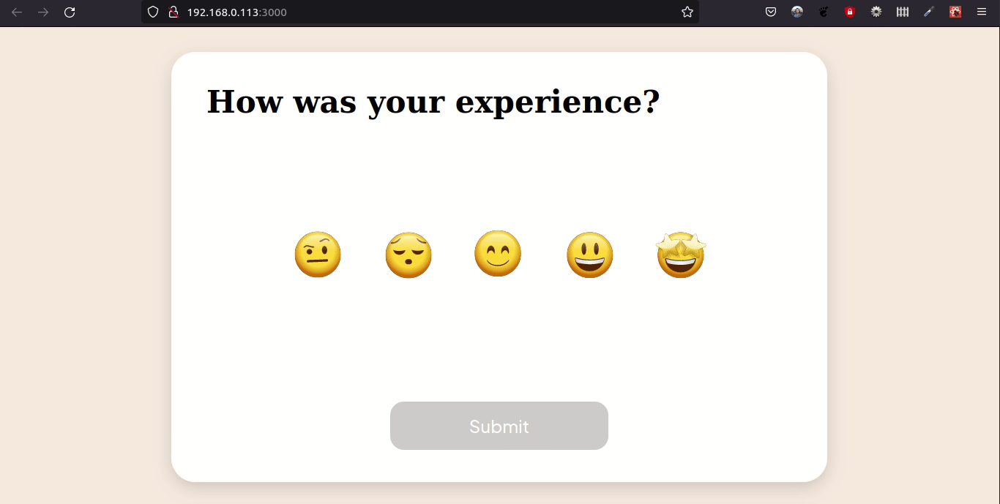

# React Feedback Component

## Description

This is an animated React feedback component. It uses [Framer Motion](https://github.com/framer/motion#readme) to create the zoom effect and [Lottie Web](https://airbnb.io/lottie/#/web) to render the animations. The styling was done through [Styled Components](https://styled-components.com/).

## Demo

## Note

The original project uses [react-lottie](https://www.npmjs.com/package/react-lottie), which is a wrapper for [bodymovin.js](https://www.npmjs.com/package/bodymovin). Since both seem to have stopped receiving updates, I used [lottie-web](https://www.npmjs.com/package/lottie-web).

## Credits

The original project can be found at [How to Make an Animated Customer Feedback Component in React.JS](https://hackernoon.com/how-to-make-an-animated-customer-feedback-component-in-reactjs)
